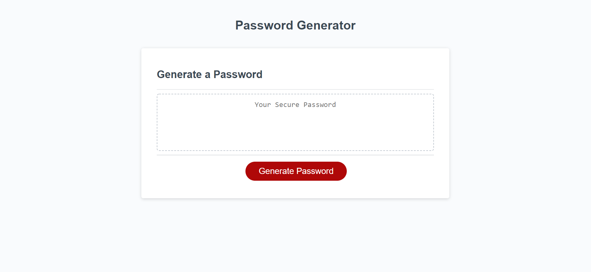
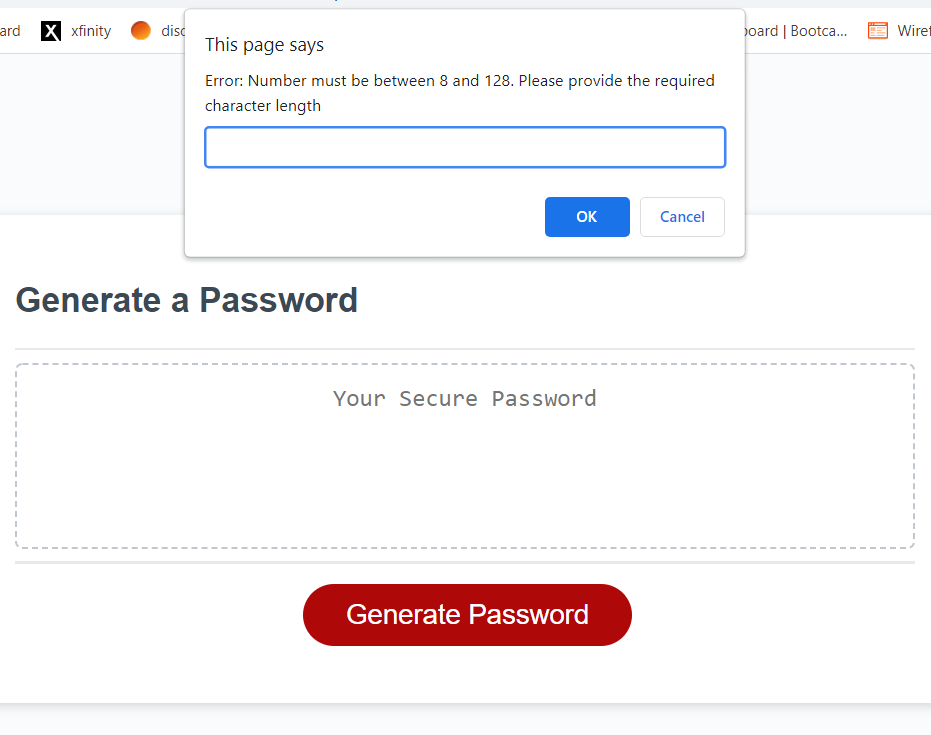

# Password-Generator

This application is used to automatically generate a password for the user. When selected, Generate Password leads to a number of prompts. These prompts include selecting the character length of the password and the types of characters they wish to include.
 

 
The passwords have a set range of minimum 8 characters to a maximum of 128. A proper ERROR message and loop has been implemented if values outside of this range are selected.
 

 
Currently selectable characters are:
* Uppercase Letters
* Lowercase Letters
* Numbers
* Special Characters
 
All selected character types are guaranteed to have at least one of each type of character.